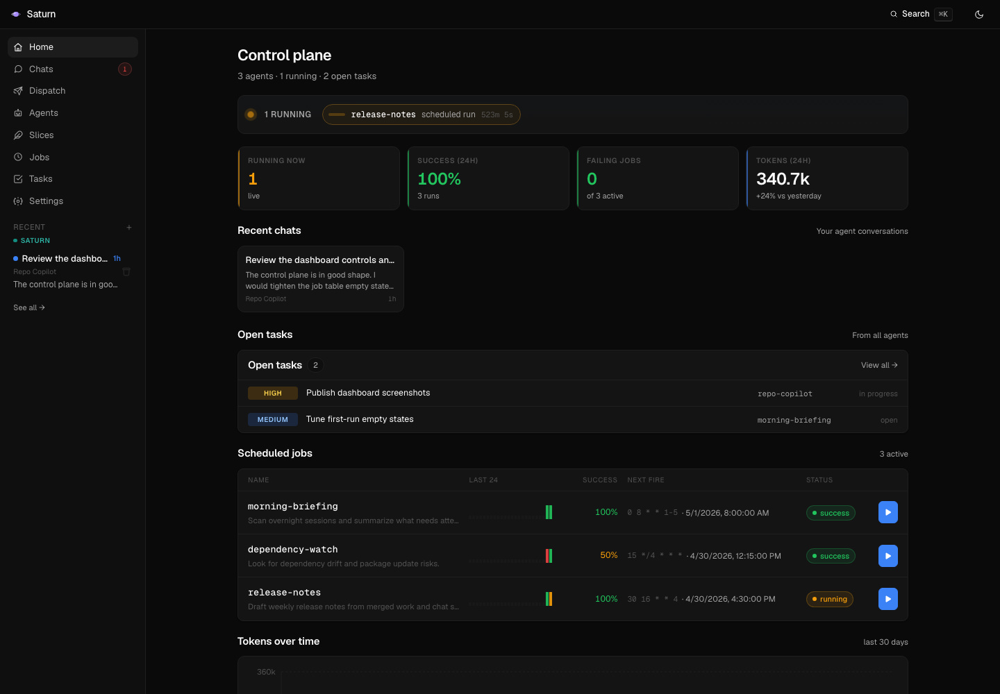
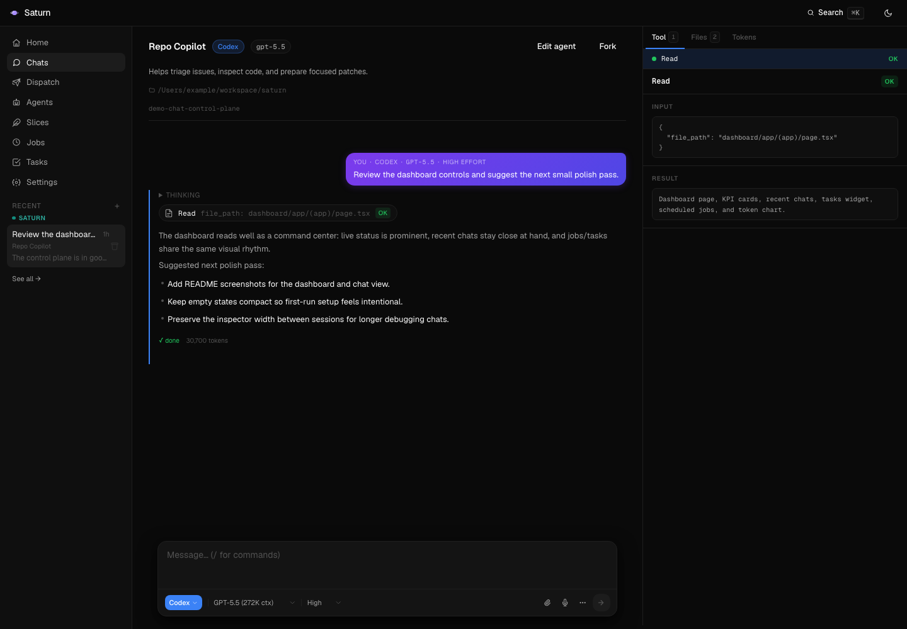

# saturn

Schedule Claude Code agent runs via native macOS cron and view results in a local Next.js dashboard.

Saturn is cool because it turns agent work into a real local control plane: schedule recurring AI jobs, jump into chats, track tasks, compare Claude Personal, Bedrock, local, and Codex backends, and keep every run visible without handing your workflow to a cloud dashboard.

---

## Screenshots

### Dashboard



### Chat



---

## Fresh Machine Setup

Paste this prompt into a terminal-capable agent to set up the entire project from scratch:

```
You are setting up Saturn from a clean macOS machine. Do all of this in order and stop if any command fails.

1. Install/verify command-line prerequisites.
   - Required: git, node/npm, jq, Claude Code (`claude`), Codex CLI (`codex`).
   - Optional but recommended: AWS CLI for `claude-bedrock`, pipx + LiteLLM for `claude-local`, LM Studio for local models.
   - If Homebrew is available, run:
     brew install git node jq awscli pipx
     pipx ensurepath
     pipx install litellm || pipx upgrade litellm
   - If the CLIs are missing, run:
     npm install -g @anthropic-ai/claude-code @openai/codex
   - Open a new shell or export the common local bins for this setup:
     export PATH="$HOME/.local/bin:$HOME/bin:/opt/homebrew/bin:/usr/local/bin:$PATH"
   - Verify:
     git --version
     node --version
     npm --version
     jq --version
     claude --version
     codex --version

2. Clone or update Saturn.
   REPO="${SATURN_REPO:-$HOME/programming/saturn_agent_harness}"
   if [ -d "$REPO/.git" ]; then
     git -C "$REPO" pull --ff-only
   else
     mkdir -p "$(dirname "$REPO")"
     git clone https://github.com/zachrizzo/saturn_agent_harness.git "$REPO"
   fi
   cd "$REPO"

3. Bootstrap the checkout.
   bin/bootstrap.sh
   This creates ignored local config files from the committed examples, writes dashboard/.env.local with the current repo path, creates runtime dirs, installs dashboard dependencies, builds the dashboard, and creates ~/bin/claude-local plus ~/litellm_config.yaml if they do not already exist.

4. Put real local secrets/config in ignored files.
   - Edit mcps.json and replace any "replace-me" MCP tokens.
   - Edit settings.json if you want a different default CLI/model.
   - For Bedrock, set settings.json `bedrockProfile` and `bedrockRegion` to the AWS CLI profile/region this Mac should use. You can also do this later in Saturn Settings.
   - Edit jobs/jobs.json only if this machine should register recurring cron jobs.
   - Run bin/sync-configs.sh after changing mcps.json or skills/.

5. Configure the backend auth paths you plan to use.
   - Bedrock:
     # Use the same profile/region saved in Saturn Settings or settings.json.
     export AWS_PROFILE="$(jq -r '.bedrockProfile // "sondermind-development-new"' settings.json)"
     export AWS_REGION="$(jq -r '.bedrockRegion // "us-east-1"' settings.json)"
     aws sso login --profile "$AWS_PROFILE"
   - Claude Personal:
     Start Saturn, choose Personal, then run /login in the chat composer; or open Settings and use Claude Personal auth.
   - Local Claude:
     Start LM Studio, serve an OpenAI-compatible model on http://127.0.0.1:1234, and make sure ~/litellm_config.yaml model_name entries match LM Studio's model ids.
   - Codex:
     Run codex once and complete sign-in if prompted.

6. Start Saturn.
   - Recommended always-on launchd service:
     cd "$REPO"
     bin/install-dashboard-service.sh
   - Foreground dev server alternative:
     cd "$REPO/dashboard"
     AUTOMATIONS_ROOT="$REPO" npm run dev
     Leave this running and use a second shell for verification.
   - Open http://127.0.0.1:3737/settings to confirm default backends, Claude Personal auth, and Bedrock AWS profile/region.

7. Verify the dashboard and model APIs.
   curl -fsS http://127.0.0.1:3737/api/models?cli=claude-bedrock >/dev/null
   curl -fsS http://127.0.0.1:3737/api/models?cli=claude-personal >/dev/null
   curl -fsS http://127.0.0.1:3737/api/models?cli=claude-local >/dev/null
   curl -fsS http://127.0.0.1:3737/api/models?cli=codex >/dev/null
   Visit http://127.0.0.1:3737 and send a short ad-hoc chat with the backend you configured.

8. Optional recurring jobs and Telegram.
   - Register cron from jobs/jobs.json:
     bin/register-job.sh
   - Install Telegram Dispatch after creating a BotFather token:
     TELEGRAM_BOT_TOKEN="123:abc" TELEGRAM_BOT_USERNAME="your_saturn_bot" TELEGRAM_ALLOWED_CHAT_IDS="123456789" bin/install-telegram-service.sh
```

---

## Model Backends

Dashboard backend IDs are:

| CLI ID | Binary | Backend |
|---|---|---|
| `claude-bedrock` | `claude` | AWS Bedrock (`CLAUDE_CODE_USE_BEDROCK=1`, AWS profile/region) |
| `claude-personal` | `claude` | Claude Code personal `/login` auth, with Bedrock/LiteLLM env cleared |
| `claude-local` | `claude` | LM Studio via LiteLLM proxy on port 4000 |
| `codex` | `codex` | Codex CLI |

The legacy stored value `claude` is accepted as `claude-bedrock`.

Bedrock uses AWS CLI credentials from the local Mac. Saturn stores only the AWS profile and region in `settings.json` (`bedrockProfile`, `bedrockRegion`) and exposes them in Settings under "Claude Bedrock AWS". The Settings UI also lists profiles returned by `aws configure list-profiles` when the AWS CLI has local profiles configured. Saturn does not store AWS credentials.

Claude Personal uses the same `claude` binary, but routes through Claude Code's personal `/login` auth path instead of Bedrock or LiteLLM. In Saturn, open Settings and use "Claude Personal auth", or switch a chat to Personal and run `/login`. Personal runs clear Bedrock, Vertex, LiteLLM, base URL, and auth-token environment variables so they do not inherit another backend by accident.

For manual terminal testing, Bedrock, Personal, and local can be run side-by-side after initial setup:

| Terminal | Command | Backend |
|---|---|---|
| Terminal 1 | `CLAUDE_CODE_USE_BEDROCK=1 AWS_PROFILE=$(jq -r '.bedrockProfile // "sondermind-development-new"' settings.json) AWS_REGION=$(jq -r '.bedrockRegion // "us-east-1"' settings.json) claude` | AWS Bedrock |
| Terminal 2 | `unset CLAUDE_CODE_USE_BEDROCK CLAUDE_CODE_USE_VERTEX ANTHROPIC_BASE_URL ANTHROPIC_AUTH_TOKEN; claude --setting-sources project,local` | Claude Personal |
| Terminal 3 | `claude-local` | LM Studio via LiteLLM proxy |

Switch model for a local session:
```bash
ANTHROPIC_MODEL=gemma4:26b-it-q4_K_M claude-local
```

### `~/litellm_config.yaml`

`bin/bootstrap.sh` creates a starter LiteLLM config if this file does not already exist. Keep the `model_name` values aligned with the model ids LM Studio exposes at `http://127.0.0.1:1234/v1/models`.

```yaml
model_list:
  # LM Studio local models (OpenAI-compatible endpoint)
  - model_name: gemma4:26b-it-q4_K_M
    litellm_params:
      model: openai/gemma4:26b-it-q4_K_M
      api_base: http://127.0.0.1:1234/v1
      api_key: lm-studio
  - model_name: gemma4:4b
    litellm_params:
      model: openai/gemma4:4b
      api_base: http://127.0.0.1:1234/v1
      api_key: lm-studio
  - model_name: qwen/qwen3.6-27b
    litellm_params:
      model: openai/qwen/qwen3.6-27b
      api_base: http://127.0.0.1:1234/v1
      api_key: lm-studio
  - model_name: nvidia/nemotron-3-nano
    litellm_params:
      model: openai/nvidia/nemotron-3-nano
      api_base: http://127.0.0.1:1234/v1
      api_key: lm-studio
  - model_name: google/gemma-4-26b-a4b
    litellm_params:
      model: openai/google/gemma-4-26b-a4b
      api_base: http://127.0.0.1:1234/v1
      api_key: lm-studio

general_settings:
  master_key: sk-local-proxy-key
```

### `~/bin/claude-local`

`bin/bootstrap.sh` also creates this wrapper if missing:

```bash
#!/bin/bash
set -euo pipefail

LITELLM_PORT="${LITELLM_PORT:-4000}"
LITELLM_CONFIG="${LITELLM_CONFIG:-$HOME/litellm_config.yaml}"
LITELLM_KEY="${LITELLM_KEY:-sk-local-proxy-key}"

_litellm_ready() {
  curl -sf -H "Authorization: Bearer ${LITELLM_KEY}" \
    "http://127.0.0.1:${LITELLM_PORT}/health" >/dev/null 2>&1
}

if ! _litellm_ready; then
  # Kill anything on the port so litellm binds 4000 (not a random port)
  lsof -ti tcp:${LITELLM_PORT} | xargs kill -9 2>/dev/null || true
  sleep 1
  echo "[claude-local] Starting LiteLLM proxy on port ${LITELLM_PORT}..."
  "${LITELLM_BIN:-$HOME/.local/bin/litellm}" --config "$LITELLM_CONFIG" --port "$LITELLM_PORT" \
    >/tmp/litellm.log 2>&1 &
  for _ in $(seq 1 20); do
    sleep 1
    if _litellm_ready; then echo "[claude-local] LiteLLM ready."; break; fi
  done
fi

exec env \
  CLAUDE_CODE_USE_BEDROCK="" \
  CLAUDE_CODE_USE_VERTEX="" \
  ANTHROPIC_BASE_URL="http://127.0.0.1:${LITELLM_PORT}" \
  ANTHROPIC_AUTH_TOKEN="${LITELLM_KEY}" \
  ANTHROPIC_MODEL="${ANTHROPIC_MODEL:-gemma4:26b-it-q4_K_M}" \
  ANTHROPIC_SMALL_FAST_MODEL="${ANTHROPIC_SMALL_FAST_MODEL:-gemma4:4b}" \
  claude "$@"
```

---

## Unified MCP + Skills config

`mcps.json` is the local single source of truth for MCP servers across Claude Code and Codex. Copy `mcps.example.json` to `mcps.json` and put real tokens only in the ignored local file. `skills/` is the shared skills directory. After editing either, run:

```bash
bin/sync-configs.sh
```

This writes:
- `~/.claude.json` → `.mcpServers`
- `~/.codex/config.toml` → `[mcp_servers.*]`
- Symlinks `skills/<name>/` into `~/.claude/skills/` and `~/.codex/skills/`

Each server entry in `mcps.json` has a `targets` array controlling which CLIs receive it.

---

## Telegram Dispatch

`bin/telegram-dispatch.mjs` lets you message Saturn through a Telegram bot. It follows the OpenClaw-style pattern: a local gateway stays online, each chat maps to a persistent Saturn session, and users can keep texting naturally while work runs in the background.

It uses Telegram long polling, so the Mac does not need a public webhook URL. Incoming Telegram messages create or continue dashboard sessions through the existing `/api/sessions` endpoints; final assistant replies are sent back to Telegram. If a turn is already running, new messages are queued and sent to the same session in order.

### Setup

1. Create a bot with Telegram's `@BotFather` and copy the bot token. The username from BotFather must be a real bot username, usually ending in `bot` (for example `saturn_personal_computer_bot`).

2. Start the dashboard first:
   ```bash
   cd "$REPO/dashboard"
   AUTOMATIONS_ROOT="$REPO" npm run start
   ```

3. Run once in allow-all mode to discover your chat id:
   ```bash
   cd "$REPO"
   TELEGRAM_BOT_TOKEN="123:abc" \
   TELEGRAM_BOT_USERNAME="your_saturn_bot" \
   TELEGRAM_ALLOW_ALL=1 \
   SATURN_BASE_URL="http://127.0.0.1:3737" \
   node bin/telegram-dispatch.mjs
   ```
   Send `/start` to the bot, then stop the process and read `telegram/state.json` for the chat id.

4. Run with a chat allowlist:
   ```bash
   cd "$REPO"
   TELEGRAM_BOT_TOKEN="123:abc" \
   TELEGRAM_BOT_USERNAME="your_saturn_bot" \
   TELEGRAM_ALLOWED_CHAT_IDS="123456789" \
   SATURN_BASE_URL="http://127.0.0.1:3737" \
   SATURN_ADHOC_CLI="claude-bedrock" \
   SATURN_ADHOC_MODEL="claude-sonnet-4-6" \
   node bin/telegram-dispatch.mjs
   ```

Optional routing:
- `SATURN_AGENT_ID=research-deep-dive` starts new Telegram chats through a saved dashboard agent.
- Without `SATURN_AGENT_ID`, the bridge creates ad-hoc sessions using `SATURN_ADHOC_CLI`, `SATURN_ADHOC_MODEL`, `SATURN_ADHOC_PROMPT`, `SATURN_ADHOC_CWD`, `SATURN_ADHOC_ALLOWED_TOOLS`, and `SATURN_ADHOC_TIMEOUT_SECONDS`.

Telegram commands:
- `/new` or `/reset` clears the current Telegram chat's session mapping.
- `/new <task>` starts a fresh session immediately.
- `/status` shows the active session status.
- `/session` shows the dashboard session id.
- `/think <low|medium|high|xhigh>` sets reasoning for this Telegram chat.
- `/model <id>` sets the model for this Telegram chat.
- `/agent <id|off>` routes new sessions through a saved dashboard agent.
- `/verbose <on|off>` toggles dashboard links and extra run details.

State lives in `telegram/state.json` and includes the Telegram update offset, per-chat session id, queued messages, and per-chat settings. Delete that file to fully reset the bridge.

### launchd

Generate and load the LaunchAgent from this checkout:

```bash
TELEGRAM_BOT_TOKEN="123:abc" \
TELEGRAM_ALLOWED_CHAT_IDS="123456789" \
bin/install-telegram-service.sh
```

Logs are written to:
- `runs/telegram-dispatch.log`
- `runs/telegram-dispatch.err.log`

---

## Layout

```
saturn/
├── mcps.example.json     # template for local MCP server config
├── skills/               # shared Claude + Codex skills (symlinked into both)
├── bin/
│   ├── bootstrap.sh      # create local configs, runtime dirs, local wrapper, npm install/build
│   ├── install-dashboard-service.sh
│   ├── install-telegram-service.sh
│   ├── run-job.sh        # cron wrapper — invokes the configured backend
│   ├── sync-configs.sh   # propagate mcps.json + skills/ to each CLI
│   └── register-job.sh   # sync jobs.json into crontab
├── jobs/jobs.example.json # template for local job registry
├── agents.example.json   # template for saved dashboard agents
├── runs/                 # runtime run data, ignored by git
├── sessions/             # runtime interactive chat sessions, ignored by git
├── tasks/                # runtime task ticketing storage, ignored by git
├── telegram/             # Telegram bridge state (created at runtime)
├── dashboard/            # Next.js UI, served at http://127.0.0.1:3737
└── launchd/com.zachrizzo.claude-cron-dashboard.plist
```

---

## One-time setup

1. **Bootstrap local files**
   ```bash
   bin/bootstrap.sh
   ```
   Edit `mcps.json` for real MCP tokens. Live config files are ignored so secrets and local paths stay out of git.

2. **Install the dashboard as an always-on service**
   ```bash
   bin/install-dashboard-service.sh
   ```
   Visit http://127.0.0.1:3737 to confirm. Stop with:
   ```bash
   launchctl bootout "gui/$(id -u)" ~/Library/LaunchAgents/com.zachrizzo.claude-cron-dashboard.plist
   ```

3. **Choose and authenticate a backend**
   Open `http://127.0.0.1:3737/settings`.
   - Claude Personal: use "Open Claude login" under Claude Personal auth, or select Personal in a chat and run `/login`.
   - Claude Bedrock: set the AWS profile/region and run `aws sso login --profile <profile>`.
   - Claude Local: start LM Studio and use the `claude-local` wrapper created by bootstrap.
   - Codex: run `codex` once and complete sign-in if prompted.

4. **Register the jobs defined in `jobs/jobs.json`**
   ```bash
   bin/register-job.sh
   crontab -l    # verify the lines marked "# saturn:<name>"
   ```

---

## Adding a new job

Open `http://127.0.0.1:3737/jobs/new` and fill in the schedule, prompt, runtime, and optional working directory. Saving the form writes `jobs/jobs.json` and syncs the job into crontab.

You can also edit `jobs/jobs.json` manually to append an object with `name`, `cron`, `prompt`, `allowedTools`, and optional `description`, `cwd`. Then:

```bash
bin/register-job.sh
```

## Testing a job manually

```bash
bin/run-job.sh my-job-name
```

The run appears in `runs/my-job-name/<timestamp>/` and in the dashboard.

---

## Notes

- Cron and launchd inherit minimal environments. The shell runners source `bin/lib/env.sh` to derive the repo root and add common Homebrew, pipx, and nvm binary paths.
- The dashboard re-reads the filesystem on every request, so new runs show up on refresh.
- Recurring tasks have no hard expiration; remove a line from `crontab -e` or delete from `jobs.json` and re-run `register-job.sh`.
- `claude-bedrock` injects `CLAUDE_CODE_USE_BEDROCK=1` plus AWS profile/region at dispatch time.
- `claude-personal` clears Bedrock, Vertex, LiteLLM, base URL, and auth-token env vars and uses Claude Code's `/login` auth path.
- `claude-local` points Claude Code at LiteLLM on port 4000 and never modifies the global config.
